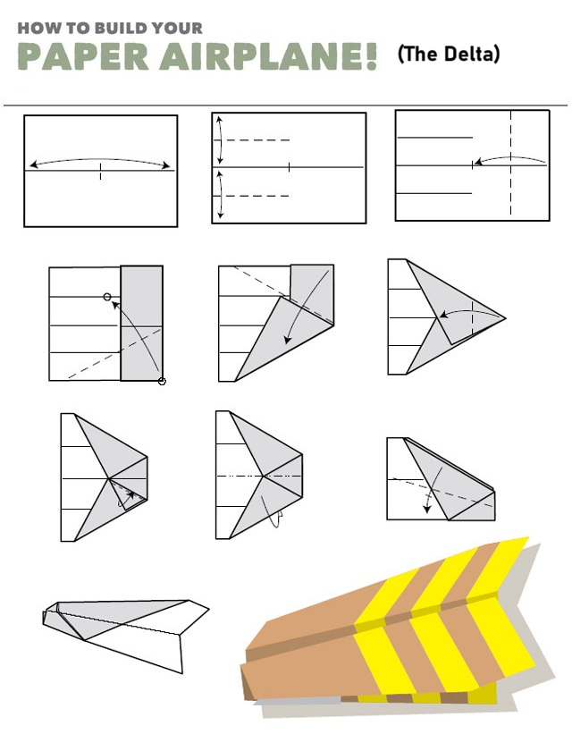
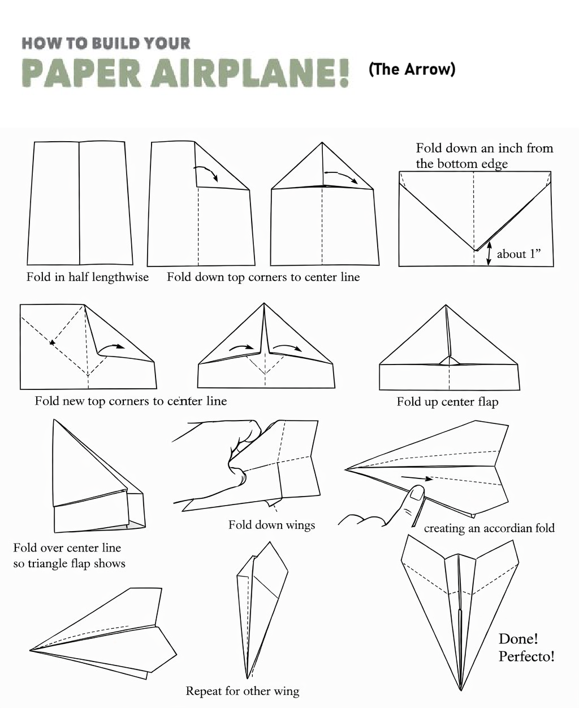
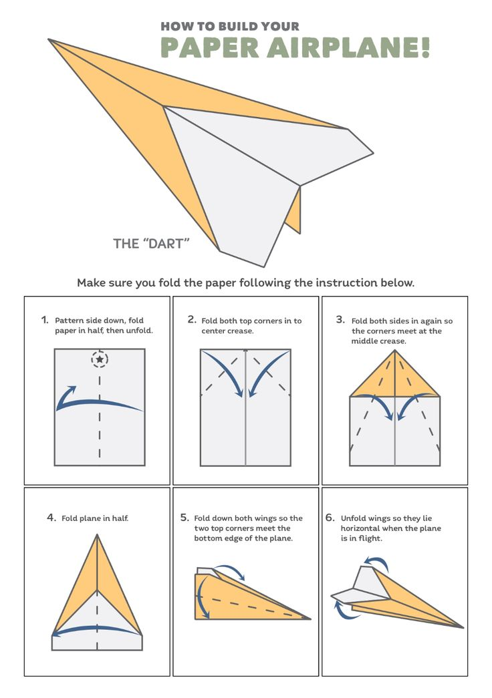
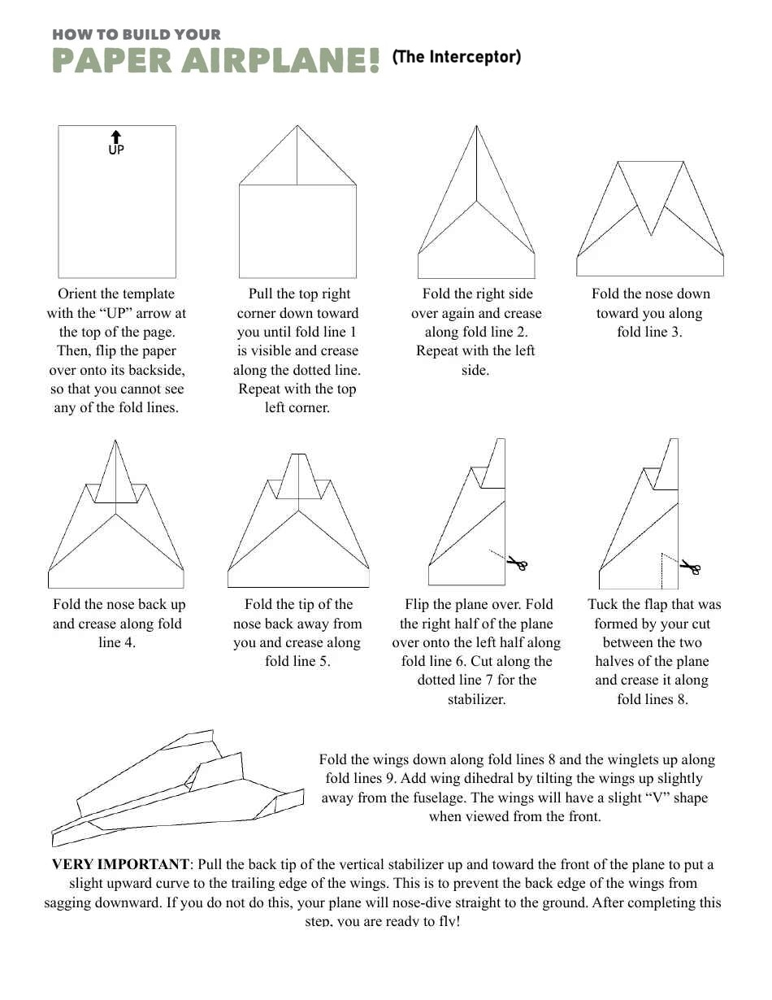

# ✈️ Paper Plane

Make your paper plane **advanced** 🚀 — explore different designs and improve flight performance using simple folding techniques and basic aerodynamics.

---

## 📌 About

This repository contains step-by-step designs of different types of paper planes.
Each design has unique characteristics like **speed, stability, distance, and control**.

---

## 🛩️ Plane Types

### 🔺 Delta Plane

A balanced design with good stability and smooth gliding.



---

### 🏹 Arrow Plane

Fast and sharp — designed for long-distance and speed.



---

### 🎯 Dart Plane

Classic and simple — great for beginners and straight flight.



---

### 🚀 Interceptor Plane

Advanced design for aggressive flight and high performance.



---

## 📂 Project Structure

```
paper-plane/
│── theInterceptor.jpg
│── theArrow.png
│── theDelta.jpg
│── theDart.jpg
│── README.md
```

---

## 🚀 How to Use

1. Open any image
2. Follow the folding steps
3. Test your plane ✈️
4. Experiment with small changes

---

## 💡 Tips for Better Flight

* Use **thin but strong paper**
* Make **sharp folds**
* Keep both wings **symmetrical**
* Adjust wing angles slightly for control

---

## ⭐ Support

If you like this project, give it a ⭐ on GitHub!

---
